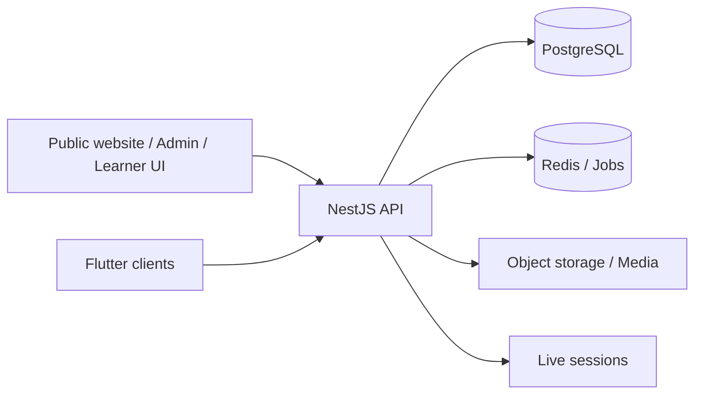

# Amoozyar — Education Platform

[← Back to profile](../README.md) · [Product website](https://amoozyar.site)

**Domain:** EdTech / SaaS  
**My focus:** Product engineering, system architecture, cross-platform experience

## The product problem

Education providers need more than a video player. Course delivery, learner access, live classrooms, administrative workflows, and payments must work as one coherent experience across different devices.

Amoozyar is an education platform that brings these responsibilities together while keeping the learner experience simple.

## Scope and engineering work

- Designed the product and technical boundaries for course management, enrollment, authentication, playback, and live sessions.
- Worked across public website, administrative and learner web interfaces, and a Flutter-based multi-platform client.
- Integrated secure playback flows, role-aware access, and live-classroom capabilities.
- Structured API, infrastructure, and integration work so product surfaces can evolve independently.
- Introduced CI checks and browser-level QA to reduce regressions across surfaces.

## Architecture, at a glance

**Technology areas:** Next.js, React, TypeScript, NestJS, PostgreSQL, Redis, Docker, S3-compatible object storage, Flutter, LiveKit.

*This diagram intentionally simplifies the system and does not represent its complete production topology.*

## Decisions that matter

**One product, multiple surfaces.** Business workflows and access rules belong in the backend, rather than being inconsistently reimplemented in each client.

**Media is a separate concern.** Media storage and delivery should not be treated like ordinary application data. Access control, file handling, and playback require their own design boundaries.

**Verification beyond successful builds.** The quality bar includes interaction and browser regression checks, not only passing compilation and unit tests.

**Incremental delivery.** Public website, admin experience, and learner clients can be validated in stages without coupling each release to every other feature.

## What I would discuss in a technical interview

- Authorization boundaries across brands, admins, and learners
- Playback delivery and access-control trade-offs
- Queueing and background processing boundaries
- Browser regression testing, CI, and operational deployment workflows

## Source availability

The application source is private because it contains proprietary product work. This case study shares design-level information only; it is **not** a security audit, implementation specification, or claim that every planned feature is already live.
