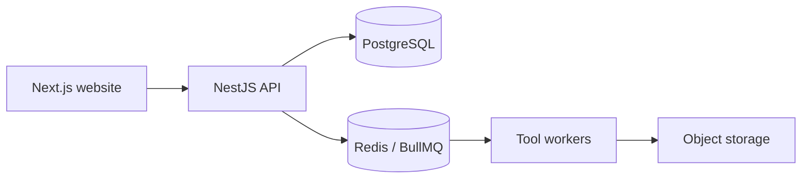

# Mimyar — Digital Product Studio & Platform

[← Back to profile](../README.md) · [Website](https://mimyar.site)

**Domain:** Product Studio / Web Tools  
**My focus:** Product strategy, UX, full-stack architecture, platform engineering

## The product problem

Delivering digital products well involves more than implementing isolated web pages. Research, UX, API contracts, content, SEO, operations, and long-term maintainability must be considered together.

Mimyar combines a digital product studio presence with a platform foundation for useful, publicly accessible tools and content.

## Scope and engineering work

- Designed the product positioning, information architecture, and end-user experience.
- Structured an evolving platform around web interfaces, APIs, and asynchronous tool execution.
- Worked on typed contracts and clear ownership of data and background jobs.
- Planned gradual migration of existing site surfaces rather than a risky all-at-once replacement.
- Included SEO, content structure, quality verification, and operation concerns in the product roadmap.

## Architecture, at a glance

**Technology areas:** Next.js, React, TypeScript, NestJS, PostgreSQL, Redis, BullMQ, Prisma, Zod, Playwright, S3-compatible object storage, Docker.

*The diagram illustrates platform responsibilities; individual tools may use different execution paths.*

## Decisions that matter

**Product boundaries before framework boundaries.** The chosen tools follow the user journey and domain requirements rather than dictating them.

**Incremental migration.** Existing experiences should remain usable while new React/Next.js implementations are introduced and tested.

**Queues for expensive work.** Jobs that involve browser automation or heavy processing should not monopolize HTTP request lifecycles.

**Treat search and content as product concerns.** Useful tools need discoverability, thoughtful information architecture, and measurable quality—not just technical correctness.

## What I would discuss in a technical interview

- Splitting web, API, and workers without premature microservices
- Shared API schemas and database ownership
- Visual regression testing during UI migration
- Trade-offs between discoverability, usability, and performance

## Source availability

The platform source is private. This case study covers architecture and reasoning at a high level and should not be treated as a statement that every roadmap feature has shipped.
