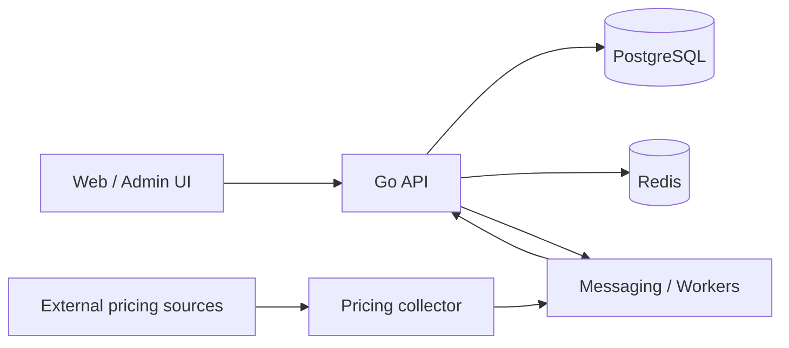

# Zarnoush — Digital Gold & Agency Platform

[← Back to profile](../README.md) · [Product website](https://zarnoushgold.ir)

**Domain:** Trading / Business Operations  
**My focus:** Backend architecture, data modeling, product engineering

## The product problem

A pricing-sensitive business platform needs more than a storefront. It needs controlled pricing, order workflows, access boundaries, and room to expand from a single operation to a hierarchical agency structure.

Zarnoush is a digital gold platform with administrative workflows and support for agency-oriented business rules.

## Scope and engineering work

- Developed an API-centered backend approach for business workflows and administrative operations.
- Modeled organization and agency relationships alongside role and permission boundaries.
- Worked on pricing-source integration, price state, policy controls, and order-related workflows.
- Separated background processing and external-data collection from request-facing operations.
- Designed deployment and operational tooling around containerized services.

## Architecture, at a glance

**Technology areas:** Go, React, PostgreSQL, Redis, NATS, Docker, and worker-based external-data processing.

*This is a conceptual view of system responsibilities, not an operational network diagram.*

## Decisions that matter

**Hierarchical authorization belongs in the domain model.** Agency ownership, access scope, and delegated permissions need explicit policies rather than scattered UI conditions.

**Separate collected data from trusted application state.** External prices are inputs; downstream trading behavior should operate on validated, policy-aware application state.

**Keep long-running work outside synchronous requests.** Collection, retries, and related background tasks need dedicated lifecycle and failure handling.

**Favor observable operations.** Trading-oriented software benefits from traceability of decisions and data changes, not just user-facing success messages.

## What I would discuss in a technical interview

- Permission modeling for an agency hierarchy
- Pricing ingestion, validation, and failure modes
- Transactional boundaries for order workflows
- Containers, migrations, and reliable operational changes

## Source availability

The main application repository is private. This write-up deliberately omits production configuration, proprietary business logic, and sensitive operational details. It does **not** imply formal financial certification or an independent security review.
